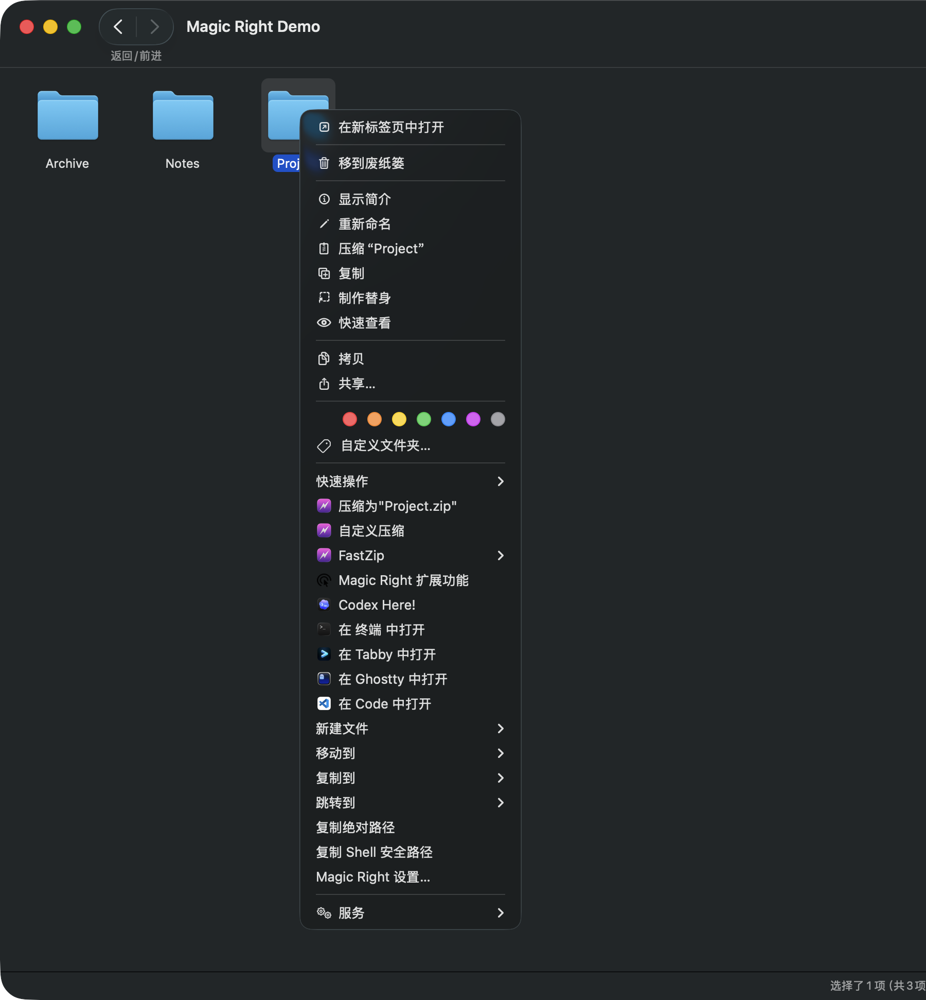
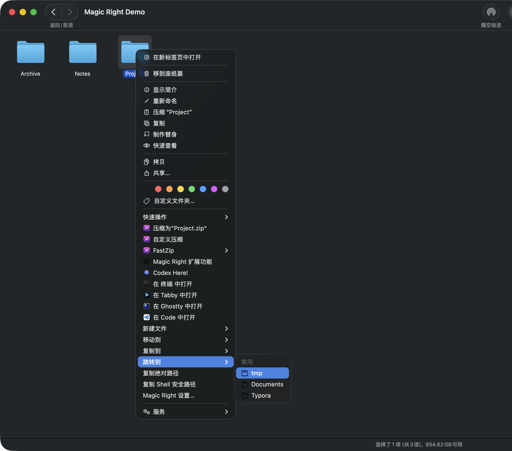
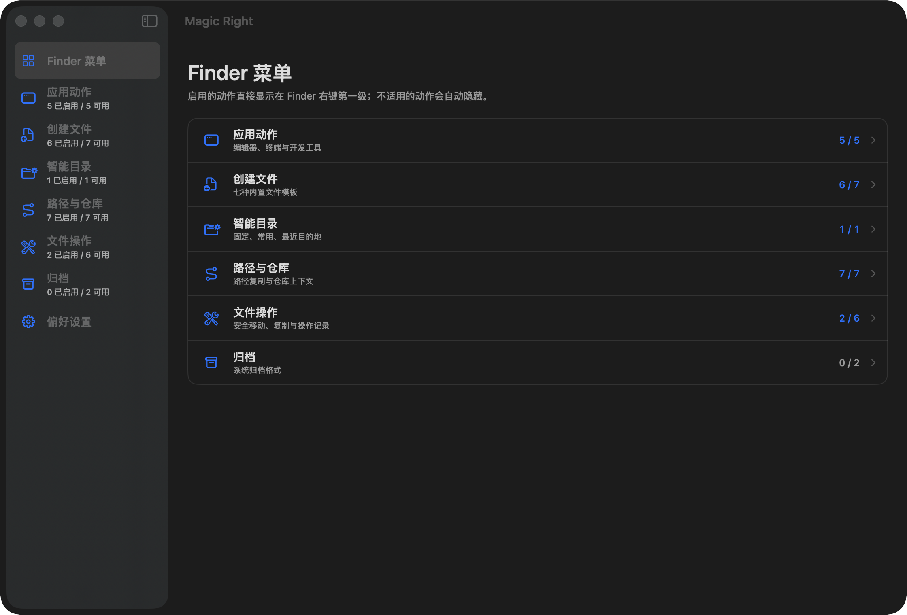
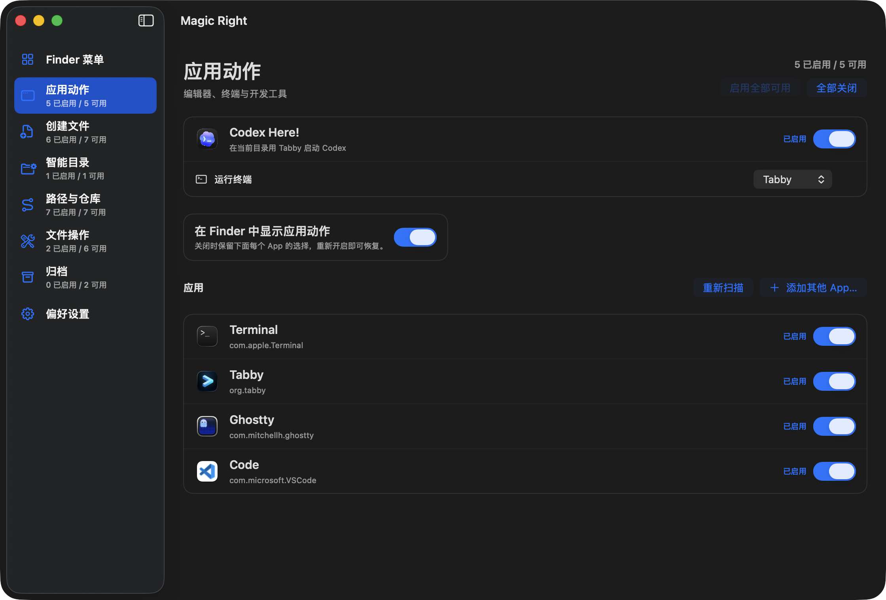

# Magic Right

<p align="center">
  
</p>

<h3 align="center">轻量、开源的 macOS Finder 右键工具箱</h3>

<p align="center">
  在当前目录打开任意 App、记住常用目的地、使用系统文件剪贴板，<br>
  让开发与日常文件操作都停留在一次右键之内。
</p>

<p align="center">
  
  
  
</p>

<p align="center"><a href="README.md">English</a></p>

> **最新版本**：[Magic Right 0.1.0](https://github.com/ZhaoPuEE/Magic-Right/releases/tag/v0.1.0) 提供适用于 macOS 15 及以上版本的 Apple Silicon DMG。当前社区构建使用 ad-hoc 签名且未经 Apple 公证；Intel Mac 尚未完成验证。

## 一次右键，连接你的工作流

| 能力 | Magic Right 的做法 |
| --- | --- |
| **在 App 中打开** | 自动发现常用编辑器、终端、IDE 与 Git 客户端；也可以手动选择任意有效 `.app`。Magic Right 只保存 Bundle ID，App 移动或重装后仍能通过 Launch Services 找回。 |
| **智能目录** | 本地学习 Finder 中实际访问的目录，以固定 / 常用 / 最近三组目的地同时服务“跳转到”“移动到”和“复制到”。不扫描目录内容，也不上传历史。 |
| **系统文件剪贴板** | 剪切与复制使用 `NSPasteboard.general` 和标准 `public.file-url`，Finder、Deck 等兼容 macOS 文件 URL 的 App 都能读取，并非 Magic Right 私有剪贴板。 |
| **Codex Here!** | Finder 始终保留一个入口；在设置中选择系统终端、Ghostty 或 Tabby，在当前目录直接进入本机 Codex。 |
| **文件工具箱** | 安全新建七类开发文件、复制路径与 Git 信息、查看文件信息与 SHA-256、创建 ZIP、校验后解压，以及无静默覆盖的移动/复制。 |

启用的动作直接平铺在 Finder 右键菜单第一级。只有需要继续选择文件类型或目的地的动作才展开自己的子菜单，不会把所有能力塞进一个总菜单。

## Finder 真机用法

<p align="center">
  
</p>

<p align="center"><sub>右键一个文件夹：Codex Here!、终端、编辑器、新建文件、目的地与路径工具都直接留在 Finder 第一级。</sub></p>

<p align="center">
  
</p>

<p align="center"><sub>“跳转到”“移动到”“复制到”复用同一组学习到的目的地，同时保持整个工具箱平铺而不套总菜单。</sub></p>

## 界面

Magic Right 是菜单栏 App，也是 Finder 功能控制中心。侧栏按应用动作、创建文件、智能目录、路径与仓库、文件操作和归档分区，每一项都可以独立进入或移出 Finder 菜单。

<p align="center">
  
</p>

<p align="center"><sub>控制中心通过轻量侧栏集中呈现功能分组与启用数量。</sub></p>

<p align="center">
  
</p>

<p align="center"><sub>集中选择 Codex Here! 终端、开关已发现的 App、重新扫描 Launch Services，或手动注册其他 macOS App。</sub></p>

## 3 分钟开始使用

### 1. 从源码运行

需要 **macOS 15 或更高版本**，以及带 macOS 15 SDK 的 Xcode；当前测试环境为 Apple Silicon Mac。

```sh
git clone https://github.com/ZhaoPuEE/Magic-Right.git
cd Magic-Right
open SuperRight.xcodeproj
```

在 Xcode 中选择 `SuperRight` scheme 和 **My Mac**，运行一次宿主 App。

### 2. 启用 Finder 扩展

打开 Magic Right → **偏好设置** → **打开扩展设置**，在 macOS 系统设置中启用 Magic Right Finder 扩展。菜单栏宿主运行时，Finder 才会显示 Magic Right 动作；退出宿主后，菜单会自动消失。

### 3. 选择你的动作

- 在**应用动作**中启用已发现的 App，或点击添加按钮手动注册任意有效 `.app`。
- 在 **Codex Here!** 中选择系统终端、Ghostty 或 Tabby。
- 在**智能目录**中固定、改名、排除或清空目的地。
- 使用“开发”“文件”或“全部内置”预设快速开始，再逐项调整。
- 可选启用“登录时自动启动”；默认关闭。

## 核心能力

### 在当前路径打开任意 App

内置适配按 Bundle ID 自动发现常见 App。手动添加时，Magic Right 接受具有可读 Bundle 元数据的有效 `.app`，保存它的 Bundle ID，并在每次使用时通过 Launch Services 解析当前位置。

Terminal、Tabby 和 Ghostty 带有目录感知行为；其他手动 App 默认使用 macOS 标准 URL 打开。Magic Right 不保存固定的 `/Applications/...` 路径，也不执行用户提供的 Shell 字符串。

### Codex Here!

Finder 中只有一个 `Codex Here!`，终端选择集中在设置里：

- **系统终端**：在现有窗口中创建本机标签页；首次使用时 macOS 会请求自动化权限。
- **Ghostty**：使用工作目录参数并直接运行已解析的 Codex 可执行文件。
- **Tabby**：复用现有实例，无窗口时自动创建窗口，再新建当前目录下的本机交互式 zsh 标签页。退出 Codex 或用 `Ctrl+C` 中断后，同一标签页会回到 zsh。

整个过程不模拟键盘输入，也不会把 Finder 路径拼进待求值的脚本源码。只有终端与本机 Codex 都可用时，Finder 才显示该动作。

### 会记忆的目的地

Magic Right 在受支持的本地根目录中记录 Finder 观察到的访问，以及由 Magic Right 打开的目录。它只保存规范化路径、访问次数和时间：

- 停留 2 秒后才计入一次访问；
- 30 分钟内的重复观察自动去重；
- 常用分数采用 30 天半衰期；
- 缺失、已排除或不可用卷上的路径不会出现在菜单中。

固定 / 常用 / 最近目录统一供“跳转到”“移动到”和“复制到”使用。“跳转到”会切换当前 Finder 窗口；没有窗口时才创建新窗口。

### 真正的系统剪贴板

文件剪切会把标准 `public.file-url` 项写入 macOS 系统剪贴板，因此 Finder、Deck 和其他兼容 App 都可以读取。Magic Right 只为自己的“粘贴”动作附加私有剪切标记：

- 来自 Magic Right 剪切的项目按移动处理；
- 其他 App 提供的标准文件 URL 按复制处理；
- 不尝试猜测其他 App 的私有剪切协议；
- 目标存在同名项目时不会静默覆盖。

### 面向文件与仓库的实用动作

- 新建 Markdown、TXT、RTF、XML、JSON、YAML 和 `.gitignore`，自动避让重名。
- 复制绝对路径、Shell 安全路径和 Git 根目录相对路径。
- 打开 Git 根目录、编辑器或远程仓库页面，并复制 origin URL。
- 查看文件大小、类型、时间和按需计算的 SHA-256。
- 创建 ZIP；安全解压 ZIP、tar、tar.gz 和 tgz。
- 创建 Finder 替身；移动、复制、剪切和粘贴均拒绝静默覆盖。

“复制 Shell 安全路径”只负责把每个路径编码成可粘贴给 zsh、bash 或 sh 的独立参数；它不会执行命令，也不代表围绕这些参数拼接的整条命令天然安全。

## 隐私与安全

- 目录学习完全留在本机，不读取目录内容，不发送遥测。
- 外部 App 以 Bundle ID 表示，路径按结构化参数传递。
- 用户文件操作拒绝静默覆盖，并记录本地操作结果。
- 宿主 App 与 Finder 扩展的权限边界、共享存储和非 App Store 分发约束详见[隐私](docs/PRIVACY.md)、[权限](docs/PERMISSIONS.md)与[架构](docs/ARCHITECTURE.md)。

Magic Right 通过 GitHub 分发，不上架 Mac App Store。当前支持的文件根目录为 `/Users/`、`/Volumes/` 与 `/private/tmp/`，仍受 macOS TCC 和普通文件权限约束。

## 开发与验证

```sh
./scripts/verify-project.sh
```

验证脚本会运行 Swift Package 单元测试、列出 Xcode scheme，并执行不签名的 Debug 构建。Release 构建、Finder 扩展验收、Developer ID 签名、公证和 DMG 流程见[构建与发布](docs/BUILDING.md)。

项目遵循几个简单原则：Finder 主线程保持轻量；用户路径永远不拼进 Shell 命令；文件绝不静默覆盖；发布资产必须原创或具有明确兼容许可证。

欢迎提交 Issue 和 Pull Request。参与开发前请阅读[架构](docs/ARCHITECTURE.md)和[更新日志](CHANGELOG.md)。

## License

Magic Right 使用 [MIT License](LICENSE)。

`Codex` 是 OpenAI 的商标。Magic Right 与 OpenAI 没有隶属、赞助或背书关系；Codex 图标仅在运行时从用户本机安装的 App 读取，仓库与安装包不重新分发该图标。
